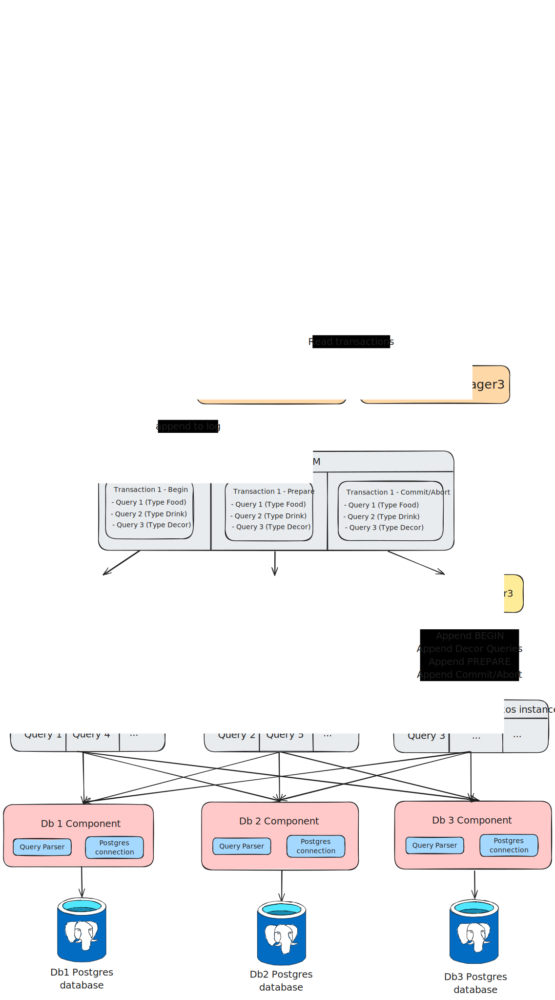

# ID2203-GOD-Project - Distributed SQL DB

Basic skeleton based on the [OmniPaxos-kv](https://github.com/haraldng/omnipaxos-kv/tree/main) library

Make sure to include .env where to connect to: see sqlx crate docs for localhost link

# 2.1 Distributed SQL Database
In this project, you will build a distributed SQL database, using omnipaxos to provide
strongly consistent replication and high availability. OmniPaxos will act as the changelog
for the database that all replicas execute queries according to.
You will be given a minimal OmniPaxosKV store implementation with omnipaxos servers
and networking running with docker. Your task is to extend the repository by connect-
ing it to a SQL database (e.g., using the sqlx crate). Modify the client to submit SQL
queries, you may need to update the KVCommand for the queries of your DB.

## 2.1.1 Requirements
### Basic Requirements (30p):
- Connect a database of your choice (not RocksDB) in the database struct.
Please note: The bonus task requires a DB that supports PREPARE TRANS-
ACTIONS (e.g., postgres)
- Implement writing to the database. The client should be able to submit a query
to one of the nodes, and it should be reflected across the system.
- Implement reading from the database. The client should be able to issue a query
that reads with one of the consistency levels: leader (read from the leader), local
(read from any node), or linearizable (a read that satisfies linearizability).
- Show with test cases that your distributed database can correctly perform writes
and reads using the different consistency levels.
### Bonus Tasks (10p): Pick one of the following bonus tasks.
- Sharding: Currently, the whole database is replicated in one OmniPaxos cluster.
This is not a scalable solution. To make the system scale, implement sharding.
Use multiple clusters of OmniPaxos that are each responsible for a subset of keys.
Create or load a table and make different clusters responsible for different value
range of the primary key (e.g., OmniPaxos 1 for keys 1-100, OmniPaxos 2 for 101-
200, etc.). Choose one of the following:
2
  - (a) Support cross-shard queries that access data from different shards. Imple-
ment two-phase commit (2PC) across shards.
  - (b) Make the sharding scheme automatic and show how the system rebalances
with a skewed workload.
---
**Category**: Distributed databases

**Language and libraries**: Rust, OmniPaxos, Tokio, Docker, SQL, postgres-tokio

**Extends**: https://github.com/haraldng/omnipaxos-kv